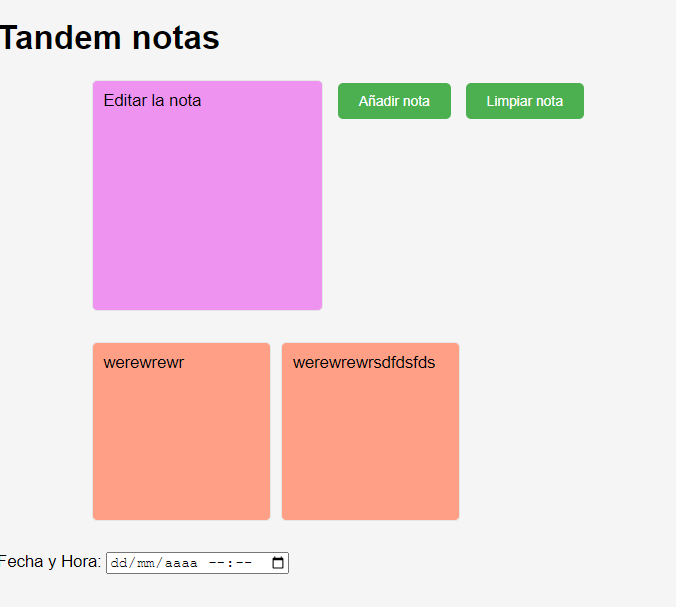

### 1. Encabezado:

**Título:** Tandemnotas

**Versión:** 0.1

**Autor(es):** Equipo de Desarrollo

**Autor:** Andra Elena Grumeza

<image src="gato.png" width="150px">

### 2. Descripción general:

El Proyecto Block de notas Tandem es un software de gestión de tareas diseñado para ayudar a los usuarios a organizar sus actividades diarias de manera eficiente.

**Funcionalidades principales:**

- Creación, edición y eliminación de tareas.
- Priorización de tareas mediante etiquetas.
- Notificaciones de recordatorio para tareas próximas a vencer.
- Visualización de estadísticas sobre el rendimiento de las tareas.

**Características principales:**

- Interfaz de usuario intuitiva y fácil de usar.
- Compatibilidad multiplataforma: disponible para Windows, macOS y Linux.
- Integración con calendarios externos para sincronizar eventos.
- Seguridad de los datos: todas las tareas se almacenan de forma segura en la nube con cifrado de extremo a extremo.

**Audiencia objetivo:** El Proyecto XYZ está dirigido a cualquier persona que necesite organizar sus tareas de manera efectiva, desde usuarios individuales hasta equipos de trabajo.

### 3. Instrucciones de instalación:

**Requisitos previos:**

- Sistema operativo compatible: Windows 10, macOS 10.12+, Linux.
- Conexión a Internet para la instalación y actualizaciones.

**Pasos de instalación:**

1. Descarga el archivo de instalación desde [enlace de descarga](https://www.ejemplo.com).
2. Ejecuta el archivo de instalación y sigue las instrucciones en pantalla.

**Opciones de instalación:** Usuarios avanzados pueden instalar manualmente desde el repositorio de GitHub utilizando el administrador de paquetes.

### 4. Instrucciones de uso:

**Información básica:** Después de instalar, inicie la aplicación y siga el asistente de configuración para empezar a utilizar el Proyecto XYZ.

**Ejemplos:**

- Crear una nueva tarea.
- Marcar una tarea como prioritaria.
- Consultar estadísticas de rendimiento.

**Casos de uso:** Explore la documentación en línea para conocer casos de uso más avanzados y consejos para aprovechar al máximo el Proyecto XYZ.

### 5. Solución de problemas:

**Problemas comunes:**

1. No se puede iniciar la aplicación.
2. No se reciben notificaciones de recordatorio.
3. Problemas de sincronización con el calendario externo.

**Recursos de soporte:**

- Documentación en línea: [enlace a la documentación](https://docs.proyectxyz.com).
- Foro comunitario: [enlace al foro](https://community.proyectxyz.com).

### 6. Información de contacto:

**Cómo ponerse en contacto con los desarrolladores:** Envíe un correo electrónico a support@proyectoxyz.com para obtener ayuda o informar sobre problemas.

**Canales de comunicación:** Únase a nuestra comunidad en GitHub: [repositorio de GitHub](https://github.com/proyectxyz).

### 7. Contribuciones:

**Cómo contribuir al proyecto:** Lea nuestras directrices para contribuir en [CONTRIBUTING.md](CONTRIBUTING.md).

**Directrices para la comunidad:** Todos los contribuyentes deben seguir nuestro código de conducta en [CODE_OF_CONDUCT.md](CODE_OF_CONDUCT.md).

### 8. Reconocimientos:

Agradecemos a todos los contribuyentes y miembros de la comunidad que han ayudado a hacer posible este proyecto.

### 9. Apéndices:

**Información adicional:** Consulte la documentación técnica adjunta para obtener más detalles sobre la arquitectura del Proyecto XYZ y los flujos de trabajo internos.
